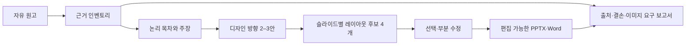

# 기획서 디자이너 설계와 구현 범위

## 목표

이 기능의 목표는 ‘한 문장을 정해진 템플릿에 채우는 PPT 생성기’가 아닙니다. 사용자가 가진 논리, 실측, 판단을 정본으로 보존하면서 다음 세 가지 시간을 줄이는 것이 목표입니다.

- 머릿속 논리를 슬라이드 순서로 다시 옮기는 시간
- 같은 내용을 표·도판·타임라인 중 무엇으로 보여줄지 결정하는 시간
- PowerPoint에서 장마다 레이아웃을 새로 잡는 시간

따라서 입력 화면은 회사·프로젝트·직무 같은 고정 양식이 아니라 자유 원고를 중심으로 설계했습니다. 특정 회사나 게임 이름은 맥락 신호 중 하나일 뿐 스키마의 필수 항목이 아닙니다.

## 핵심 데이터 흐름

`DeckIR`가 이 흐름의 정본입니다. AI 응답이나 화면 상태가 정본이 아니므로 공급자, UI, 출력 형식이 바뀌어도 근거 추적과 사용자 수정은 보존됩니다.

## 6단계 구현

### 1. 기반과 비용 안전장치

- Oh My PPT의 Electron·React·SQLite 구조를 유지했습니다.
- Codex 구독, OpenRouter, 오프라인 공급자를 같은 구조화 인터페이스로 연결했습니다.
- 기본은 Codex 구독 우선이며 OpenRouter는 명시적 선택과 예산 검사 없이는 호출하지 않습니다.
- API 키는 메인 프로세스에서만 복호화하고 렌더러에는 상태만 전달합니다.

### 2. DeckIR와 근거 추적

- 원문, 인벤토리, 주장, 슬라이드, 데이터 요구, 이미지 슬롯을 ID로 연결합니다.
- 사용자 작성, AI 압축, AI 제안 등 문장 변환 출처를 구분합니다.
- revision, checksum, 마이그레이션으로 이전 작업을 안전하게 읽습니다.
- 근거 없는 수치 대신 `[DATA REQUIRED]` 항목을 만듭니다.

### 3. 맥락형 디자인과 레이아웃 엔진

- 디자인 방향은 문서의 어조, 증거 형태, 논리 전환, 밀도에서 도출합니다.
- 팔레트, 타이포 성격, 반복 모티프, 내비게이션, 증거 표현, 히어로 장을 하나의 방향으로 묶습니다.
- 각 슬라이드에 네 가지 레이아웃 후보와 선택 이유를 생성합니다.
- 같은 계열이 세 장 연속되지 않도록 덱 전체 리듬을 계산합니다.
- 표지·전환·클로징은 필요할 때 그리드를 깨는 히어로 구성을 우선합니다.

레이아웃은 무작위 장식이 아닙니다. 비교, 과정, 인과, 수치, 메커니즘, 트레이드오프 같은 논리 구조와 실제 근거물의 형태가 후보 점수에 반영됩니다.

### 4. 자유 입력과 부분 재생성 UI

- 입력 형식을 강제하지 않는 원고 편집 영역을 추가했습니다.
- 근거 추출 → 논리 목차 → 디자인 방향 → 레이아웃 선택을 단계별로 실행합니다.
- 헤드라인과 본문은 화면에서 바로 수정할 수 있습니다.
- 디자인 방향은 2–3안, 레이아웃은 장마다 네 후보를 비교합니다.
- 전체 덱을 다시 만들지 않고 한 장의 후보만 다시 계산할 수 있습니다.
- 한국어가 기본이며 기존 `zh` 설정은 최초 로드에서 `ko`로 이동합니다.

### 5. Office 출력과 감사 보고서

- PPTX는 라이브 텍스트와 네이티브 벡터 도형으로 만듭니다.
- Word는 실제 스타일, 번호 체계, 머리글·바닥글, 고정 폭 표를 사용합니다.
- 두 형식 모두 내보내기 때 AI를 호출하지 않습니다.
- 누락 데이터, 이미지 슬롯, 콘텐츠 매핑, 금지 표현, 반복 레이아웃, 스토리보드 폴백을 JSON으로 기록합니다.

### 6. 회귀 검증과 인계

- DeckIR 스키마·마이그레이션·무결성 테스트
- AI 공급자 선택·예산·키 비노출 테스트
- 디자인 후보 다양성·반복 방지·히어로 선택 테스트
- UI 문구와 IPC 계약 테스트
- PPTX의 실제 6장 렌더와 오버플로 검사
- Word의 OOXML 파싱, 실제 숨김 Word 렌더, 접근성, 제목, 표 구조 검사

## 레이아웃 다양성이 획일성을 막는 방식

단순히 레이아웃 목록을 늘리면 결과는 여전히 획일적일 수 있습니다. 이 구현은 선택 조건을 분리합니다.

1. 슬라이드 논리 구조로 가능한 레이아웃 계열을 좁힙니다.
2. 수치, 이미지, 상태, 비교 대상처럼 실제 근거 형태로 점수를 조정합니다.
3. 표지·전환·클로징 역할과 정보 밀도를 반영합니다.
4. 앞뒤 장과 같은 계열이 반복되면 감점합니다.
5. 사용자 선택을 저장하고, 자동 재계산은 선택되지 않은 장만 바꿉니다.

이 때문에 같은 ‘게임 기획서’라도 전투 프레임 분석, 캐릭터 콘텐츠 제안, 라이브 운영 회고가 서로 다른 디자인 방향과 레이아웃 리듬을 갖게 됩니다.

## 알려진 한계

- 이미지 자체는 사용자가 나중에 넣는 흐름을 기본으로 하며, 현재는 설명·구도·해상도·주석 슬롯을 만듭니다.
- Pretendard 파일이 실행 환경에 없으면 Office가 호환 글꼴로 대체합니다.
- 보조 슬라이드 작업실의 오래된 화면에는 한국어 번역이 없는 일부 문구가 영어로 표시될 수 있습니다. 기획서 설계 화면과 주요 탐색·설정 화면은 한국어가 기본입니다.
- 자동 업데이트는 비활성화되어 있습니다. 새 버전은 이 프로젝트에서 검증한 포터블 실행 파일로만 교체합니다.

## 다음 확장 후보

- 사용자가 만든 좋은 슬라이드를 레이아웃 사례 라이브러리로 축적
- 실제 이미지 교체와 주석 위치 유지
- 조직별 문체·금지 표현 프로필
- DOCX 표·상태도·검증 계획을 직무별이 아니라 콘텐츠 구조별로 더 세분화
- 출력 결과의 썸네일을 작업 화면에서 바로 비교하는 비가시 백그라운드 QA
