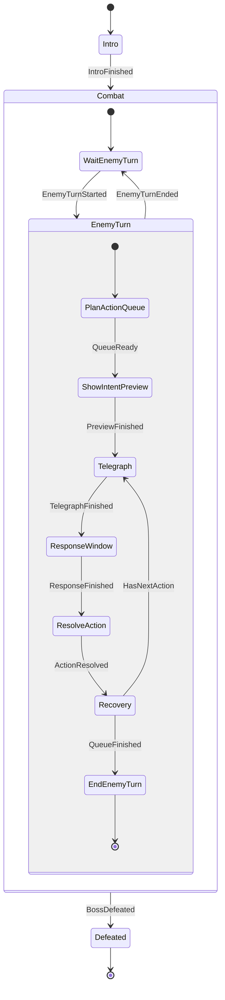

# BOSS_CASE001 Unity HFSM 최소 계약 v0.2

이 문서는 Unity 구현을 시작하기 위해 지금 고정해야 하는 상태 뼈대와 데이터 연결만 확정한다.

- 지금 확정: 상위·하위 상태, 상태 전이 이벤트, 행동 3개 예고, 테이블 조회 키
- Unity 테스트 후 조정: 행동 가중치, 대응 시간, 연출 길이, VFX, 최종 피해 수치
- 아직 확정하지 않음: 보스 페이즈, 고유 마법, BREAK의 공식 효과, 대응 성공의 공식 효과

따라서 HFSM 전체 연출과 패턴을 지금 최종 확정할 필요는 없다. 아래 상태 이름과 책임만 코드 계약으로 유지한다.

## 1. 설계 기준

이 보스는 특별한 경계 마법을 사용하는 인물이 아니다.

> 영지 조정 결과에 불복해 전투를 선택한 마법사 A.

- 보스 최종 이름과 클랜명은 미정이다.
- 구체적인 고유 마법도 미정이다.
- Unity 기능 목업에서는 범용 공격 마법만 사용한다.
- 경계는 사건의 소재일 뿐, 보스 능력·전투 규칙·HFSM 상태로 사용하지 않는다.
- BREAK는 이 보스만의 기능이 아니라 모든 적에게 적용되는 공통 전투 규칙이다.

---

## 2. 데이터 연결

| 역할 | 데이터 ID |
|---|---|
| CASE 난이도(쉬움·확장용) | `1050001` |
| CASE 난이도(보통·현재 구현) | `1050002` |
| CASE 난이도(어려움·확장용) | `1050003` |
| 보스 | `2060001` |
| Unity 보스 HFSM | `BossCase001Hfsm` |
| 공통 전투 규칙 | `2010001` |
| 공통 BREAK 발생 조건 | `GaugeZero` |
| Prototype 적 행동 감소 | `1` |
| Prototype Gauge 초기화 | `NextTurnStart` |

```text
BossCase001Hfsm
→ 보스가 행동 3개를 선택하고 실행하는 순서 담당

Common Break Controller
→ 모든 적의 BREAK 발생과 공통 효과 담당
```

보스 HFSM 안에 CASE 전용 BREAK 효과를 넣지 않는다.

난이도는 HFSM 상태가 아니다. 콘텐츠가 선택한 `CaseDifficultyTable.id`로 전투 `BattleTable.caseDifficultyId`를 찾고, 해당 행이 HP·공격력·BREAK Gauge 배율을 Battle Controller에 전달한다. 세 난이도 모두 같은 `BossCase001Hfsm`을 재사용한다. 현재 Unity는 NORMAL(1050002)만 진입시킨다.

---

## 3. 왜 HFSM인가

보스 패턴 자체는 단순하지만, `Combat` 안에 `EnemyTurn`이라는 하위 상태 묶음이 있고 그 안에서 행동 선택·예고·대응·실행이 다시 나뉜다.

```text
BossCase001Hfsm
├─ Intro
├─ Combat
│  ├─ WaitEnemyTurn
│  └─ EnemyTurn
│     ├─ PlanActionQueue
│     ├─ ShowIntentPreview
│     ├─ ActionLoop
│     │  ├─ Telegraph
│     │  ├─ ResponseWindow
│     │  ├─ ResolveAction
│     │  └─ Recovery
│     └─ EndEnemyTurn
└─ Defeated
```

상태 안에 다시 하위 상태가 들어가므로 FSM이 아니라 HFSM으로 구성한다.

---

## 4. 상태 구조도



BREAK 전이는 이 보스 HFSM 구조도에 넣지 않는다. 공통 Battle Controller가 `CombatRuleTable.breakTriggerType`을 기준으로 처리한다.

---

## 5. 상태별 역할

### `Intro`

- 보스 등장 연출을 재생한다.
- 전투 UI와 HP/BREAK Gauge를 활성화한다.
- 종료되면 `Combat`으로 이동한다.

### `Combat.WaitEnemyTurn`

- 플레이어 행동이 진행되는 동안 대기한다.
- Battle Controller가 `EnemyTurnStarted`를 보내면 `EnemyTurn` 하위 머신으로 들어간다.

### `EnemyTurn.PlanActionQueue`

- `BossActionTable`에서 현재 보스의 행동 후보를 읽는다.
- `selectionWeight`를 이용해 행동 3개를 선택한다.
- 같은 행동이 세 번 연속 선택되지 않도록 한다.
- 선택 결과를 `plannedActionIds`에 저장한다.

### `EnemyTurn.ShowIntentPreview`

- 선택된 행동 3개를 적 행동 예고 UI에 먼저 표시한다.
- 아직 공격을 실행하지 않는다.

### `EnemyTurn.ActionLoop.Telegraph`

- 현재 행동의 대상과 공격 예고를 표시한다.
- `BossActionTable.telegraphType`을 읽는다.

### `EnemyTurn.ActionLoop.ResponseWindow`

- `responseWindowMs` 동안 플레이어 대응 입력을 기다린다.
- 회피 입력 성공 여부를 `responseSucceeded`에 저장한다.
- 회피 AP 1과 현재 적 행동 1개 취소는 Unity 기능 검증용 Prototype 규칙이다.

### `EnemyTurn.ActionLoop.ResolveAction`

- `unityActionKey`에 연결된 실제 Unity 마법 행동을 실행한다.
- 회피에 성공했다면 현재 적 행동을 취소하고 HP 피해를 적용하지 않는다.
- 회피하지 않았다면 HP 피해를 적용한다.

### `EnemyTurn.ActionLoop.Recovery`

- 공격 후딜레이를 처리한다.
- 남은 행동이 있으면 다음 `Telegraph`로 이동한다.
- 행동 3개를 모두 실행하면 `EndEnemyTurn`으로 이동한다.

### `EnemyTurn.EndEnemyTurn`

- 적 Turn 종료를 Battle Controller에 알린다.
- 다시 `WaitEnemyTurn`으로 돌아간다.

### `Defeated`

- 마지막 HP Bar가 소진되면 진입한다.
- 행동 선택과 입력 대기를 종료한다.
- 패배 연출 후 `BossDefeated` 결과를 Battle Controller에 전달한다.

---

## 6. BREAK 공통 처리

전투 기준판에서 확인된 내용은 다음까지다.

```text
공격
→ BREAK Damage
→ 적 BREAK Gauge 감소
→ Gauge가 0이면 BREAK 발생
```

다음 내용은 아직 미정이다.

- 행동불능 여부
- 받는 피해 증가 여부
- 행동 지연 여부
- 추가 AP 여부
- BREAK의 공식 회복 방식

따라서 테이블은 다음처럼 둔다.

```text
CombatRuleTable
- id = 2010001
- breakTriggerType = GaugeZero
- breakEnemyActionReduction = 1
- breakGaugeResetTiming = NextTurnStart
```

Unity 목업에서는 BREAK 발생 Turn의 적 행동을 1개 줄이고 다음 Turn 시작 시 Gauge를 최대치로 초기화한다. 이는 공식 확인값이 아니라 `Prototype` 임의 설정이다. `CommonBreakController`가 처리하며, `BossCase001Hfsm`에 경계 붕괴 같은 CASE 전용 효과를 넣지 않는다.

---

## 7. 보스 행동

보스의 구체 마법이 공개되거나 설정되지 않았으므로 기능 목업용 범용 마법만 사용한다.

### `BossMagicBolt` — 마력탄

- 단일 대상을 공격한다.
- 가장 자주 선택되는 기본 행동이다.

### `BossMagicVolley` — 연속 마력탄

- 단일 대상을 연속 공격하는 가안이다.
- 일반 마력탄보다 선택 가중치가 낮다.

### `BossMagicBurst` — 광역 마력 폭발

- 파티 전체를 대상으로 하는 광역 마법 가안이다.
- 세 행동 중 가장 낮은 선택 가중치를 가진다.

이 이름과 수치는 모두 Unity 기능 목업을 위한 `Prototype`이며 보스의 공식 고유 기술이 아니다.

---

## 8. 블랙보드

| 이름 | 형식 | 용도 |
|---|---|---|
| `plannedActionIds` | List<int> | 이번 적 Turn에 예고한 행동 3개의 숫자 ID |
| `currentActionIndex` | int | 현재 실행 중인 행동 위치, 0~2 |
| `currentActionId` | int | 현재 실행할 보스 행동의 숫자 ID |
| `targetCharacterId` | int | 현재 공격 대상의 숫자 ID |
| `responseSucceeded` | bool | 회피 성공 및 현재 적 행동 취소 여부 |
| `isDefeated` | bool | 보스 최종 패배 여부 |

경계 활성 여부, 영지 스택, 판결 스택 같은 전용 값은 만들지 않는다.

---

## 9. Unity 데이터 로드 순서

```text
콘텐츠 CaseFlowTable의 BATTLE 단계(id = 1040002)
→ 콘텐츠 CaseDifficultyTable에서 선택 난이도 행 조회
   ├─ 쉬움: 1050001 / isImplemented=false
   ├─ 보통: 1050002 / isImplemented=true
   └─ 어려움: 1050003 / isImplemented=false
→ 같은 caseDifficultyId를 가진 전투 프로젝트 BattleTable 행 조회
   ├─ bossHpMultiplier
   ├─ bossDamageMultiplier
   └─ breakGaugeMultiplier
→ 공통 전투 데이터
   ├─ CombatRuleTable (BREAK 발생 조건 포함)
   ├─ CharacterTable / CharacterActionTable
   └─ BossTable
      └─ BossActionTable (선택 가중치 포함)
→ BossCase001Hfsm 생성
```

---

## 10. Unity 구현 완료 기준

1. 현재 구현 대상인 `caseDifficultyId = 1050002`로 BattleTable을 찾아 `bossId = 2060001`을 불러온다.
2. `BattleTable`의 난이도 배율을 Battle Controller에 적용한다.
3. 현재 HFSM 경로를 화면에 표시한다.
4. 적 Turn 시작 시 범용 마법 행동 3개가 먼저 예고된다.
5. `Telegraph → ResponseWindow → ResolveAction → Recovery`가 순서대로 실행된다.
6. 세 행동을 모두 사용하면 적 Turn이 종료된다.
7. BREAK Gauge가 0이 되면 공통 `CommonBreakController`가 적 행동을 1개 줄인다.
8. 다음 Turn 시작 시 BREAK Gauge를 최대치로 초기화한다.
9. 두 효과가 공식 규칙이 아닌 Prototype 임의 설정임을 코드와 영상 설명에서 구분한다.
10. 마지막 HP Bar 소진 시 `Defeated`로 이동하고 기존 `CaseContentController.OnBattleCleared(1040002, 1050002)`를 호출한다.

---

## 11. 포트폴리오 영상에서 보여줄 것

```text
HFSM: Combat > EnemyTurn > ActionLoop > Telegraph
ActionId: 2070001
UnityActionKey: BossMagicBolt
Queue: [2070001, 2070002, 2070003]
BreakTriggerType: GaugeZero
BreakEnemyActionReduction: 1
BreakGaugeResetTiming: NextTurnStart
```

영상 순서:

```text
1. 테이블 데이터 로드
2. 행동 3개 예고
3. 범용 마법 행동 실행
4. 대응 행동 입력
5. BREAK Gauge 0 → 해당 Turn 적 행동 1개 감소
6. 다음 Turn 시작 → BREAK Gauge 최대치 초기화
7. 보스 HP 소진 → Defeated
8. CASE 결말 시나리오 이동
```

게임 화면과 현재 HFSM 경로를 함께 보여주면 계층 상태 구조를 증명할 수 있다.

---

## 12. 미확정 항목

- 보스 최종 이름과 클랜명
- 보스 고유 마법
- 공식 BREAK 효과와 회복 규칙(현재 목업은 Prototype 임의 설정 사용)
- 대응 성공 시 정확한 결과
- 실제 Unity Scene/Prefab/Addressables Key
- 최종 HP와 공격 계수

확정되지 않은 항목은 다른 게임의 규칙을 가져와 채우지 않는다.
