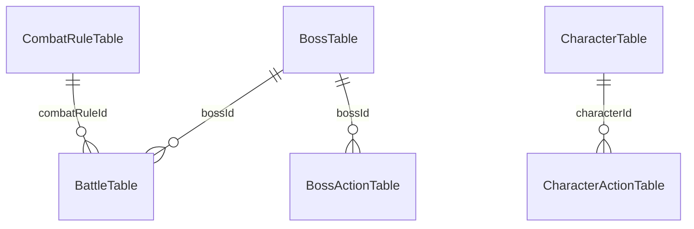

# CASE_001 전투·캐릭터 데이터 구조

`BattleTable`의 난이도별 행은 같은 보스와 HFSM을 사용하고 HP·공격력·BREAK Gauge 배율만 다르게 전달한다. Unity 보스 HFSM은 `BossTable.hfsmControllerKey`와 각 행동의 `unityActionKey`·`selectionWeight`를 사용한다. BREAK는 `CombatRuleTable.breakTriggerType`·`breakEnemyActionReduction`·`breakGaugeResetTiming`을 읽는 공통 Battle Controller가 처리한다.
