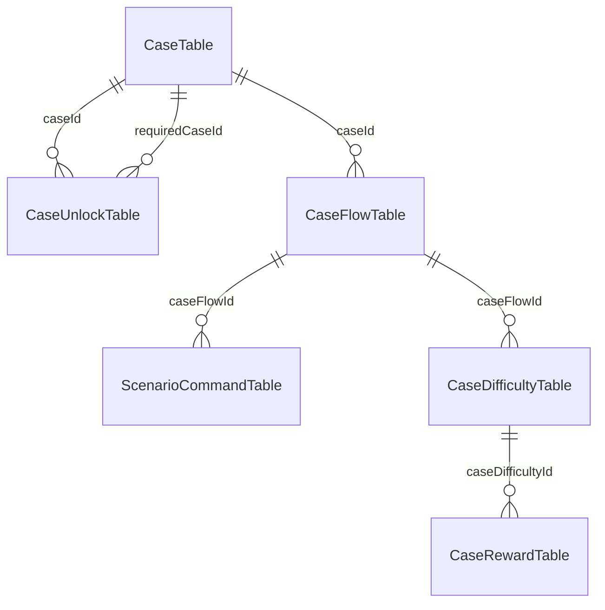

# CASE_001 콘텐츠 데이터 구조

```mermaid
erDiagram
  CaseTable ||--o{ CaseUnlockTable : caseId
  CaseTable ||--o{ CaseFlowTable : caseId
  CaseTable ||--o{ CaseUnlockTable : requiredCaseId
  CaseFlowTable ||--o{ ScenarioCommandTable : caseFlowId
  CaseFlowTable ||--o{ CaseDifficultyTable : caseFlowId
  CaseDifficultyTable ||--o{ CaseRewardTable : caseDifficultyId
```

모든 PK/FK는 숫자형 단일 열이다. 실제 반복 데이터만 1:N으로 분리하고 이름만 가진 중간 테이블은 두지 않는다.
